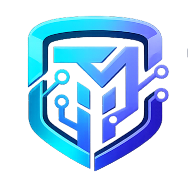

<h1 align="center">TekModus</h1>

Building modern web applications and scalable digital solutions.

  

---

## 🚀 About TekModus

TekModus is a software development startup focused on building modern web applications, SaaS platforms, and innovative digital products for businesses worldwide.

We specialize in high-performance applications, scalable architecture, and modern UI/UX design.

---

## 💻 Our Services

- Custom Web Development
- SaaS Platform Development
- MERN Stack Applications
- UI/UX Design
- API Development
- AI Integration

---

## 🛠 Tech Stack

- React
- Node.js
- MongoDB
- Firebase
- Express
- Tailwind CSS

---

## 📂 Featured Projects

### 🔹 TekModus Portfolio
Modern animated portfolio website.

### 🔹 AI Chatbot Platform
AI-powered chatbot for student learning and support.

### 🔹 Client Dashboard
Dashboard for managing projects and analytics.

---

## 🌐 Website

https://tekmodus.netlify.app

---

## 📫 Contact

tekmodous@gmail.com
